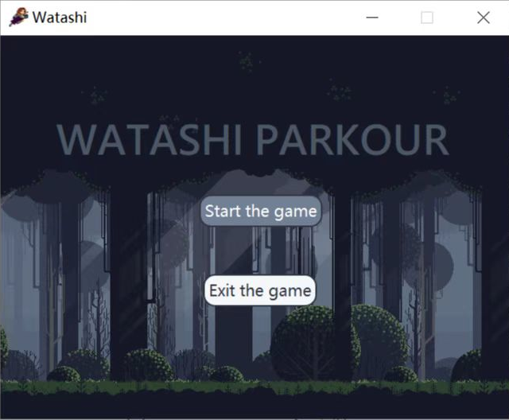
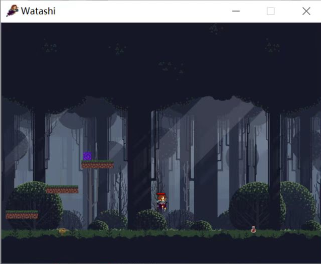
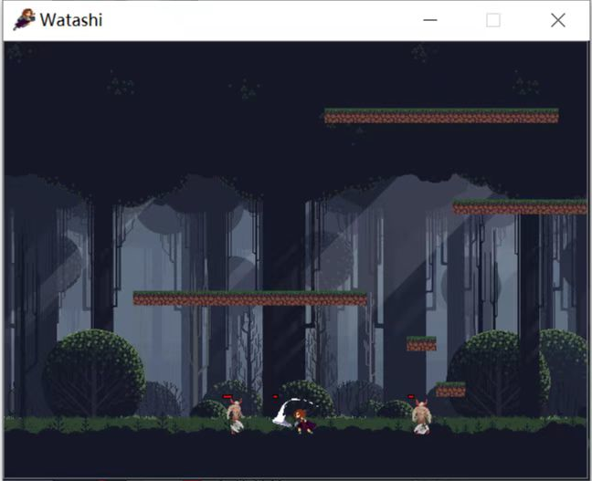
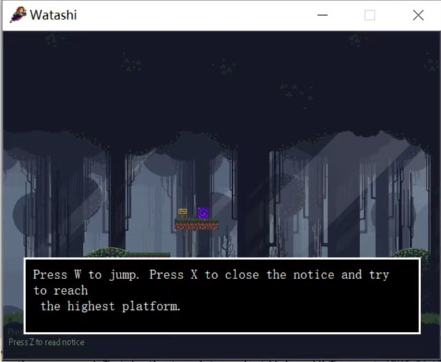
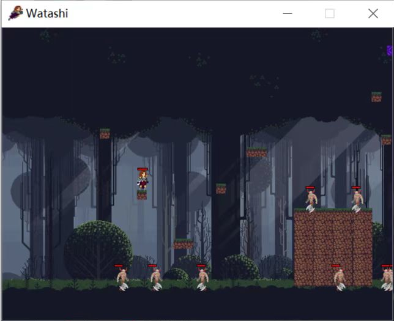
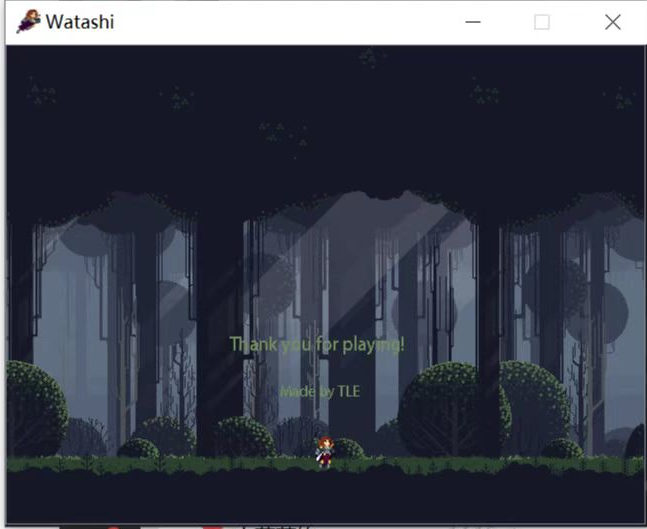

# Watashi Parkour

## —— TLE队 程设大作业报告

## 零、预览



<center>开始菜单</center>



<center> 游戏内跳跃 和 传送门 和 血瓶 </center>



<center>近战攻击</center>



<center> 告示牌 及 交互 </center>



<center> 地图 和 怪物 </center>



<center> 结束界面 </center>


## 一、 程序功能

程序为横版第三人称游戏，具体功能如下：

1） 启动程序进入开始界面，可以选择开始游戏或关闭程序。

2） 开始游戏后玩家从地图左端出发，抵达gate（紫色传送门）并点击Z键进入下一关，全部通关（目前共7关，可自己设计关卡）后游戏结束。

3） 游戏中可按Esc退出游戏。

4） 角色可水平跑动（按A/D键），跳动（按W键），攻击（分为近程和远程），大跳（按Shift键，消耗血量）。角色具有一定的初始血量，血量为0时死亡，死亡后可按X键重新开始关卡。（由于多个键同时按下有极小概率冲突，可以按T键重置速度为0）

5） 地图内有敌人巡逻，并在距离玩家一定距离时尝试攻击玩家。

6） 地图内有healpotion和notice board道具。其中healpotion会在与玩家相遇时为玩家补充血量。玩家靠近notice board并按下Z键可查看游戏提示，按X键可关闭提示。 

## 二、 项目各模块与类设计细节

### 1. 文件和类结构

游戏根目录下存有attr，map，texture四个文件夹以及各个类的头文件和资源文件。

其中，attr存放一些全局属性，如某个实体是否悬浮等等；map用json文件存放各关卡数据；texture存放图片资源。

程序主要包含block，entity，gamewidget，musics，popup，moji，scene几个类。

Block由QgraphicsPixmapItem派生，用于布置游戏地图里出现的方块。

Entity由QgraphicsPixmapItem派生，用于创建npc、玩家、物品和noticeboard等实体。

Gamewidget由QWidget派生，用于产生窗口呈现游戏内的各项内容，并接受键盘输入信号。

Musics用于实现游戏音效和背景音。

Popup由QgraphicsPixmapItem派生，moji由popup派生，用于实现显示notice board的提示的功能。

MapScene由QgraphicsScene派生，用于放置以上的Block和Entity这些像素画对象，并承担了一些处理全局性事件的功能。 

### 2. 主要的过程处理

以下简要介绍几个重要的过程。

#### MapScene::Load(int level)

Load函数的功能是从文件中加载某一个关卡并插入场景中。主要有以下步骤：

1. 初始化各种全局变量，如当前关卡编号等。
2. 播放背景音乐。
3. 加载`map/level-t/info.json`中的关卡全局信息，如左边界、右边界、底部边界的位置。
4. 加载`map/level-t/bgimg.png`作为背景图像，并插入场景。
5. 加载`map/level-t/entity.json`中用json对象表示的实体的信息，初始化实体，并插入场景。
6. 加载`map/level-t/block.json`中用json对象表示的方块的信息，初始化实体，并插入场景。
7. 建立计时器，用于之后处理周期性事务用。

#### MapScene::Refresh()

Refresh函数和计时器相绑定，以50ms为周期触发，用于处理周期性事务，如下落、攻击判定等，步骤如下：

1. 遍历图中的所有Item，若和Watashi（玩家控制的Player对象）有交，则调用MapScene::Pickup(item)将物品捡起（修改人物属性值，并从场景中删除item）。
2. 处理实体的在重力作用下下落的过程。遍历图中所有的Player和Npc对象，取对象的左下角和右下角连成QGraphicsLineItem线段对象，分情况讨论：
   1. 线段和方块有交，或线段y坐标在地面之下。此时人物处于站在地面的状态，只能向上跳。
   2. 线段在下一时刻的位置（由当前位置+y轴速度推算）和方块有交，或线段y坐标在地面之下。此时人物会和地面碰撞，推算出路径和地面的交点，并将y速度设为0。
   3. 线段在下一时刻的位置和方块无交，则做自由落体，y轴速度增加向下的分量。
3. 处理角色间的近战攻击事件。判断Player和哪些Npc有交，若实体能够攻击且正处于攻击状态，则对对方造成伤害，并造成击退效果。角色hp降至0以下处理死亡事件。
4. 处理子弹和角色的碰撞事件。之前按下K键时通过MapScene::Shoot(shooter)来生成从shooter出发并有初速度的子弹实体。（相当于发射子弹）而子弹和角色的碰撞检测在Refresh中完成。遍历找出和子弹有交的角色，并对其造成伤害和击退效果。角色hp降至0以下处理死亡事件。
5. 根据角色的状态，调用Entity::setStatusPic(QString sta)修改对象的贴图，以实现更加优秀的动画效果。
6. 在MapScene::GiveDeath(Entity* ett)中处理死亡事件。npc死亡可能掉落新的实体，需要在处理死亡事件时生成新实体。Watashi死亡时计时暂停，跳出提示窗口来重新开始本关卡。
7. 将视图view的中心固定在watashi所在的位置。
8. 由于在遍历过程中会杀死实体或产生实体，即对列表边遍历边插入/删除，需要进行额外的垃圾处理。具体实现上，insert可以先插入临时列表；delete可以将指针插入集合，在第一次遍历结束后再遍历第二遍并删除打过标记的实体。

### 3. 关于地图

每一关的地图由`entity.json` `block.json` `info.json`来表示。

```
		entity.json		# 存放每个实体的属性，结构为[{某一实体属性},...]
		block.json		# 存放每个方块的属性，结构为[{某一实体属性},...]
		info.json		# 关卡的某些信息（待定），内容为<QString,any>的键值对
```

取某一个`entity.json`为例子讲解：

```json
[
	{
		"x": 200,
		"y": 650,
		"type": "watashi",
		"hp": 90
	},
	{
		"x": 220,
		"y": 640,
		"type": "notice",
		"moji": "Oh no, Enemy ahead! Press J to attack."
	},
	{
		"x": 300,
		"y": 650,
		"type": "npc",
		"name": "hapi",
		"hp": 70,
		"heritage": {
			"x": 200,
			"y": 650,
			"type": "gate",
			"to": 2
		}
	}
]
```

地图中存在三个实体，分别为玩家、npc和告示板。实体的属性由键值对表示。

而npc的heritage属性为一个json对象，代表npc死亡时生成的实体。

在MapScene::Load()中，从json文件中读取json对象，然后将json对象带入Entity及其派生类的构造函数Entity::Entity(const QJsonObject& obj)来初始化实体对象。

这种方案好处在于：

1. 可定制程度高，只需修改json文件的对应属性值即可，方便添加各种属性，便于拓展功能。
2. 可以嵌套存储对象，如heritage中存储的对象。

## 三、 小组分工

陈国赐：构建游戏基本架构，实现角色移动，角色与item的碰撞，关卡传送，整合其他组员的代码。

朱乐豪：实现角色与npc的攻击和生命值判定，以及实现角色动画效果。完善角色与方块的碰撞判定。

王超艺：实现游戏重力判定，设计开始界面交互，关卡地图规划与设计。人物贴图资源整合与处理。

## 四、 项目总结与反思

作为一个横版游戏，本项目主要采用了键盘按键的交互方式，视图上主要采用QGraphicsPixmapItem像素画对象来显示实体和方块等元素。开始界面则是标准的由点击按钮控件交互的GUI图形界面。在开发过程中，我们既习得了标准QT GUI界面的开发设计，也学会了运用QGraphicsItem的绘图式的界面设计，还掌握了QTimer、QMediaPlayer等控件和QVector、QJsonObject等QT标准库的使用。借此，我们对QT界面开发有了更深的认识。在开发过程中，我们也在组队之中熟悉了中小型项目的开发，增强了团队协作开发的能力。在开发中，我们也产生了许多奇思妙想，如用Json文件存储对象信息，这对我们之后的编程开发提供了许多启示。

而在开发的过程中，我们发现有部分地方仍需改进：

1. 由于工期受限，导致没能创作更多的关卡，引入更多种类的实体和方块。
2. 处理全局事件的架构可以改进，通过信号和槽进行通信。

